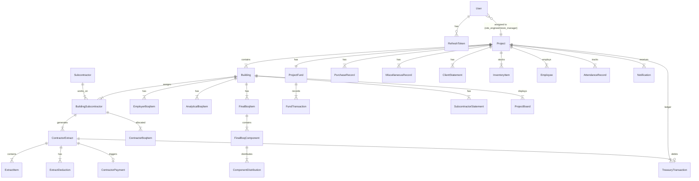

# Backend Migration Plan — El Wataniya Construction ERP

> **Status:** Foundation complete. Awaiting approval before business module implementation.

---

## 1. Current State Summary

### Frontend (Source of Truth)
- **Location:** `frontend/`
- **Stack:** Next.js 16, React 19, TypeScript, Tailwind, next-intl (AR/EN)
- **Data layers (3 parallel — must unify):**
  1. `frontend/server/store/dataStore.ts` — in-memory API-backed finance
  2. `frontend/lib/boqStore.ts` — client-side BOQ/extracts (~1500 lines)
  3. `frontend/lib/mockData.ts` — static mocks + localStorage persistence

### Existing API Routes (8 files — to migrate)
| Method | Path | Module |
|--------|------|--------|
| GET/POST | `/api/auth` | Auth |
| GET/POST | `/api/projects` | Projects |
| GET/POST | `/api/extracts` | Extracts |
| DELETE | `/api/extracts/:extractId` | Extracts |
| GET | `/api/extracts/payments` | Extracts |
| GET/POST | `/api/treasury/:projectId` | Treasury |
| GET/POST | `/api/fund/:projectId` | Fund |
| POST | `/api/fund/:projectId/expense` | Fund |

### Client-Only Domains (no API yet)
BOQ pipeline, statements, inventory, employees, clients, suppliers, attendance, notifications, boards, estimates.

---

## 2. Required NestJS Modules

| Priority | Module | Description |
|----------|--------|-------------|
| P0 | `auth` | JWT login/register/refresh — **DONE (foundation)** |
| P0 | `users` | User profile, role management — **DONE (foundation)** |
| P1 | `projects` | Project CRUD + project-scoped access |
| P1 | `buildings` | Buildings per project |
| P1 | `subcontractors` | Subcontractor registry + building assignments |
| P2 | `boq` | Employer → Analytical → Final → Contractor BOQ pipeline |
| P2 | `extracts` | Contractor extracts, payments, calculations |
| P2 | `treasury` | Project treasury ledger |
| P2 | `fund` | Petty cash (عهدة) + expense routing |
| P3 | `statements` | Client + subcontractor statements |
| P3 | `purchases` | Purchase records linked to fund/treasury |
| P3 | `miscellaneous` | Miscellaneous expenses |
| P4 | `inventory` | Stock management with transactions |
| P4 | `employees` | HR records + attendance |
| P4 | `clients` | Client registry |
| P4 | `suppliers` | Supplier registry |
| P4 | `notifications` | System notifications |
| P4 | `boards` | Project photo boards |
| P4 | `estimates` | Client/company estimates |

---

## 3. Database Entities & Relationships



### Entity Field Reference (from frontend types)

#### Project
`id, name, description, location, status, startDate, endDate?, budget?, createdAt`

#### Building
`id, name, code, projectId, type, startDate, description, status`

#### Subcontractor
`id, name, specialty/workType, phone, email?, marginType?, marginValue?, address?, joinDate, status`

#### BuildingSubcontractor (junction)
`buildingId, subcontractorId, workType, agreedPrice, status`

#### BOQ Items (Employer/Analytical share BoqItemBase)
`itemCode, description, unit, quantity, unitPrice, totalValue`

#### FinalBoqItem (extends base)
`remainingQuantity, isAnalyzed, status (pending|analyzed|partial|distributed|completed), components[]`

#### FinalBoqComponent
`id, name, unit, quantity, unitPrice, totalValue, isDistributed, distribution[], remainingQuantity`

#### ComponentDistribution
`contractorId, contractorName, quantity, percentage, assignedAt`

#### ContractorBoqItem
`itemCode, description, unit, assignedQuantity, unitPrice, totalValue, componentId?, finalItemId?`

#### ContractorExtract
`id, buildingId, projectId, contractorId, date, status (running|final), runningNumber?, label, insurancePercent, items[], deductions[], totalWorkValue, previousPaid, totalDeductions, netPayable, signatures?`

#### ExtractItem
`itemCode, description, unit, contractQuantity, previous, current, total, executionPercent, executedQuantity, unitPrice, workValue`

#### ExtractDeduction
`id, name, amount, percent?, type (manual|insurance|previous_paid), readOnly?`

#### ContractorPayment
`id, buildingId, contractorId, date, amount, extractId?, notes?`

#### TreasuryTransaction
`id, projectId, sourceType (extract|purchase|miscellaneous|initial|adjustment), sourceId, amount, description, date, notes?, metadata?`

#### ProjectFund
`id, projectId, initialBalance, currentBalance, lastUpdated, transactions[]`

#### FundTransaction
`id, type (add|deduct|request), category, amount, description, date, referenceId?, status?`

#### PurchaseRecord
`id, projectId, name, quantity, unit, price, total, date, supplier?, notes?`

#### MiscellaneousRecord
`id, projectId, description, amount, category (food|transport|tools|other), date, notes?, createdBy`

#### SubcontractorStatement
`id, statementNumber, workType, items[], deductions[], totalWorkValue, totalDeductions, previousPaid, netPayable, insurancePercent?, runningNumber?, blockNumber?`

#### StatementItem
`id, itemName, unit, previous, current, total, executionPercentage, quantity, unitPrice, totalAmount, hasInsurance, insuranceAmount, netAmount`

---

## 4. API Design (Target)

All endpoints prefixed with `/api`. Frontend `lib/api/financeApi.ts` is the contract reference.

### Phase 1 — Finance (migrate existing routes)
```
GET    /api/projects
POST   /api/projects
GET    /api/projects/:id
PATCH  /api/projects/:id

GET    /api/extracts?buildingId&contractorId
GET    /api/extracts/meta?buildingId&contractorId&runningNumber?
POST   /api/extracts
DELETE /api/extracts/:extractId
GET    /api/extracts/payments?buildingId&contractorId

GET    /api/treasury/:projectId
POST   /api/treasury/:projectId

GET    /api/fund/:projectId
POST   /api/fund/:projectId
POST   /api/fund/:projectId/expense
```

### Phase 2 — BOQ
```
GET/POST   /api/buildings/:buildingId/boq/employer
GET/POST   /api/buildings/:buildingId/boq/analytical
GET/POST   /api/buildings/:buildingId/boq/final
POST       /api/buildings/:buildingId/boq/final/:itemId/analyze
POST       /api/buildings/:buildingId/boq/final/components/:componentId/distribute
GET/POST   /api/buildings/:buildingId/contractors/:contractorId/boq
```

### Phase 3 — Statements & Master Data
```
CRUD /api/buildings/:buildingId/subcontractors
CRUD /api/buildings/:buildingId/statements
CRUD /api/projects/:projectId/client-statements
CRUD /api/inventory, /api/employees, /api/clients, /api/suppliers
CRUD /api/attendance, /api/notifications, /api/boards
```

---

## 5. Services Architecture

```
Controller (thin)
  └── Service (business logic)
        └── Repository (Prisma)
        └── Shared Calculations (lib)
```

### Critical shared calculations (must NOT duplicate)
| Function | Source | Target |
|----------|--------|--------|
| `calcExtractItem` | `frontend/lib/boqStore.ts` | `ExtractCalculationService` |
| `computeExtractTotals` | `frontend/lib/extractCalculations.ts` | `ExtractCalculationService` |
| `getPreviousPaidForNewExtract` | `frontend/server/services/extractService.ts` | `ExtractService` |
| `getPreviousQuantities` | `frontend/server/store/dataStore.ts` | `ExtractService` |
| `validateExtractItems` | `frontend/server/store/dataStore.ts` | `ExtractService` |
| `syncPaymentAndTreasury` | `frontend/server/services/treasuryService.ts` | `TreasuryService` |
| BOQ distribution validation | `frontend/lib/boqStore.ts` | `BoqService` |
| Treasury balance | `frontend/server/services/treasuryService.ts` | `TreasuryService` |
| Fund balance check | `frontend/server/services/treasuryService.ts` | `FundService` |

All financial operations must run inside **database transactions**.

---

## 6. DTOs & Validation Rules

### Extract Create DTO
```typescript
class CreateExtractDto {
  @IsString() buildingId: string;
  @IsString() contractorId: string;
  @IsString() projectId: string;
  @IsDateString() date: string;
  @IsEnum(['running', 'final']) status: string;
  @IsOptional() @IsInt() @Min(1) runningNumber?: number;
  @IsString() @MaxLength(100) label: string;
  @IsNumber() @Min(0) @Max(100) insurancePercent: number;
  @ArrayMinSize(1) @ValidateNested({ each: true }) items: ExtractItemDto[];
  @IsOptional() @ValidateNested({ each: true }) manualDeductions?: DeductionDto[];
}
```

### Key Validation Rules (preserve from frontend)
- Extract: `buildingId`, `contractorId`, `projectId`, `items.length > 0`
- Extract item `total` ≤ contractor BOQ `assignedQuantity` per `itemCode`
- Fund expense: amount > 0 AND amount ≤ `fund.currentBalance`
- BOQ distribution: sum of component distributions = component quantity
- BOQ allocation: qty ≤ `remainingQuantity`
- Final item qty cannot drop below already-allocated qty
- All amounts: finite, ≥ 0 (use integer cents internally)
- Strings: trim, max length, XSS sanitize

### RBAC Enforcement
- `@Roles(UserRole.CEO, UserRole.ACCOUNTANT)` on financial write endpoints
- `@RequirePermission('extracts:write')` on extract mutations
- `canAccessProject()` guard on all project-scoped routes
- Approved financial documents: immutable (revision/cancellation only)

---

## 7. Migration Phases (Implementation Order)

### Phase A — Foundation ✅ (this deliverable)
- [x] Monorepo workspace (`frontend/` + `backend/`)
- [x] NestJS + Prisma + PostgreSQL + Docker
- [x] JWT auth + RBAC guards
- [x] Global validation + exception filter + logging
- [x] Swagger documentation
- [x] User/RefreshToken schema

### Phase B — Core Finance (first business module)
1. Projects + Buildings entities
2. Migrate `/api/projects`
3. Treasury + Fund entities
4. Migrate treasury/fund routes
5. Extracts + Payments entities
6. Migrate extract routes with calculation service
7. Seed data aligned with frontend mock data

### Phase C — BOQ Pipeline
1. All BOQ entity tables
2. BOQ service with distribution/allocation validation
3. Move `boqStore.ts` logic server-side
4. Frontend switches to API calls (no behavior change)

### Phase D — Statements & Master Data
1. Subcontractor/client statements
2. Inventory, employees, suppliers, clients
3. Attendance, notifications, boards

### Phase E — Frontend API Cutover
1. Point `financeApi.ts` to NestJS backend
2. Replace localStorage stores with API calls
3. Wire AuthContext to JWT flow
4. Enable RBAC in frontend from real user role
5. Remove Next.js route handlers (`frontend/app/api/`)

---

## 8. Known Issues to Resolve During Migration

| Issue | Resolution |
|-------|-----------|
| Two role enums (`admin/manager/viewer` vs `ceo/technical_office/...`) | Backend uses `UserRole` enum matching `permissions.ts` |
| Duplicate `TreasuryTransaction` in `types/project.ts` vs `types/finance.ts` | Use `types/finance.ts` as canonical |
| `boqStore` vs `dataStore` amount inconsistencies | Single seed script, transactional writes |
| `getCurrentUser()` hardcoded CEO | Wire to JWT context |
| Auth accepts any credentials | Real bcrypt + JWT (foundation done) |
| No API auth checks | Global `JwtAuthGuard` (foundation done) |
| Floating-point money | Store as `Decimal` / integer cents in Prisma |

---

## 9. Foundation Deliverables

### Workspace Structure
```
elwataniya-company/
├── frontend/          # Next.js app (unchanged behavior)
├── backend/           # NestJS API
│   ├── prisma/        # Schema + migrations
│   └── src/
│       ├── auth/      # JWT authentication
│       ├── users/     # User profile
│       ├── health/    # Health check
│       ├── prisma/    # Prisma service
│       └── common/    # Guards, filters, interceptors, decorators
├── docker-compose.yml # PostgreSQL
├── .env.example
└── docs/
    └── BACKEND_MIGRATION_PLAN.md
```

### Running the Foundation
```bash
# Start PostgreSQL
npm run docker:up

# Install dependencies
npm install

# Setup backend database
cd backend
cp .env.example .env
npm run prisma:generate
npm run prisma:migrate
npm run prisma:seed

# Start backend (port 3001)
npm run dev:backend

# Start frontend (port 3000)
npm run dev:frontend

# Swagger docs
open http://localhost:3001/api/docs
```

### Default Admin Credentials (seed)
- Email: `admin@elwataniya.com`
- Password: `Admin@123`

---

## 10. Approval Gate

**STOP HERE.** Do not implement business modules until approved.

Next step after approval: **Phase B — Core Finance** (Projects → Treasury → Fund → Extracts).
